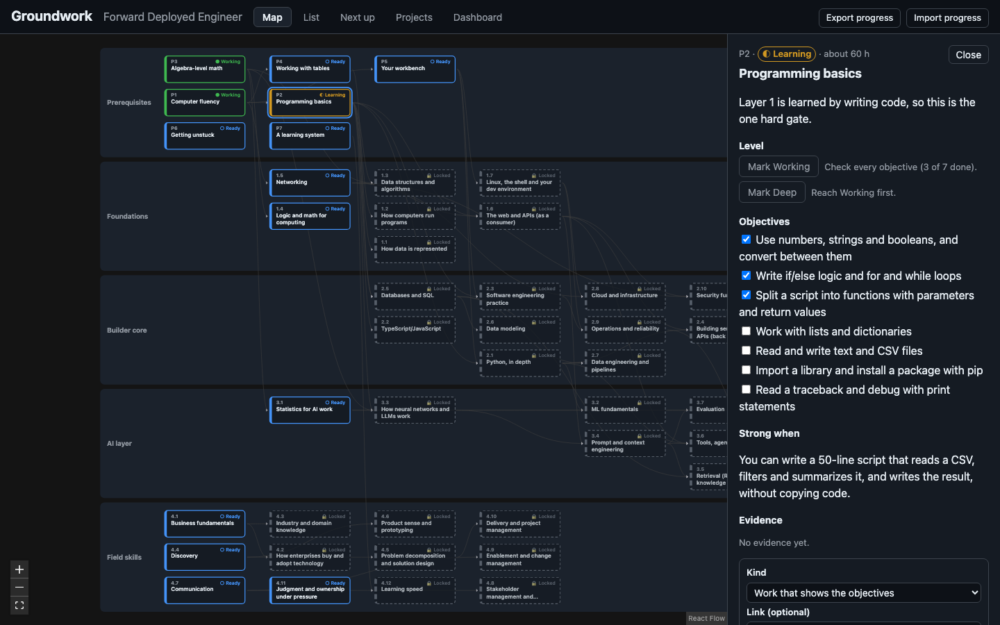
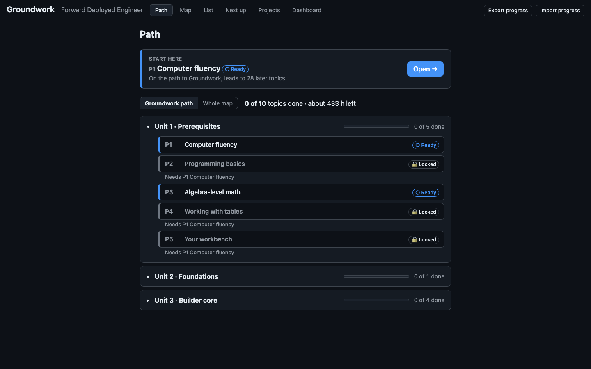

# Groundwork

Your curriculum as an interactive map of topics, prerequisites and proof. Groundwork shows what you're ready to learn next, and it won't let you mark a topic as learned until you've shown evidence.

**Live demo:** https://mjbevivino.github.io/groundwork/ (runs entirely in your browser; your progress never leaves it)



## The problem

Long self-study plans fail in two quiet ways. You can't see what you're ready for, so you either stall or skip ahead into material that assumes things you never learned. And "done" drifts: a topic you skimmed feels the same as one you can actually use.

Groundwork treats a curriculum as a graph. Each topic lists its prerequisites, its objectives, and a "strong when" test that says what mastery looks like. A topic unlocks only when its prerequisites are solid, and it moves to Working only with every objective checked and a piece of evidence attached.

## What it does



- **Path (the default tab):** a guided route instead of the whole map at once. A Continue bar brings you back to the last topic you opened, or suggests the best next one. Pick a scope (your active project's path or the whole map) to see topics done and hours left, then work through units (one per layer), each with a progress bar. Topics are in study order: prerequisites always first, then map order.
- **Lessons:** open a topic as a full, readable page with a breadcrumb, why it matters, objectives, resource cards, the strong-when test, evidence and level buttons. Previous and Next (or ← →) walk the study order, and reaching Working offers the next topic.
- **Map view:** one lane per layer, prerequisites on the left, arrows to what they unlock. Every level shows as a color plus an icon and text; locked topics are dimmed and dashed. Select a topic to highlight everything it needs and everything built on it.
- **Levels with rules:** Locked → Ready → Learning → Working → Deep. Working needs every objective and at least one piece of evidence. Deep needs evidence that you passed the strong-when test. Already know something? Test out from Ready straight to Working with evidence.
- **Reviews:** reaching Working schedules a review in 7 days, then 21, then every 60. An overdue review shows a "Needs review" badge. Nothing is ever demoted automatically.
- **Next up:** the five best things to work on now, each with a one-line reason, ranked by your active project, how much each topic unlocks, layer and estimated hours.
- **Projects:** pick an active project and see every topic on its path, in prerequisite order.
- **Dashboard:** counts by level and by layer, estimated hours done, and reviews due.
- **List view:** everything the map does, as a keyboard-friendly list (arrow keys, Home, End, Enter, Escape).
- **Your data stays yours:** progress is saved in your browser (IndexedDB). Export it as JSON, and import it on another device.

## Run it

Requires Node.js 22.12 or newer.

```bash
npm install
npm run dev        # http://localhost:5173
npm test           # 118 tests
npm run lint       # oxlint
npm run build      # type-check and production build
```

## How it works

```
maps/fde.yaml ──▶ map/load.ts ──▶ graph/graph.ts ──▶ progress/levels.ts ──▶ ui/*
  (YAML)          parse + Ajv      references,        locked / ready        map, list,
                  validation       cycles, order,     from stored           panel, views
                                   ready set,         progress
                                   reachability            ▲
                                                           │
                              progress/rules.ts ───────────┤  every level change
                              progress/store.ts (Dexie) ───┘  saved to IndexedDB
                              rank/nextUp.ts  ◀── graph functions, active project
```

| Folder         | What it holds                                                                                                              |
| -------------- | -------------------------------------------------------------------------------------------------------------------------- |
| `src/map`      | Types that mirror `schema/map.schema.json`, the YAML loader, and validation errors that name the topic by title            |
| `src/graph`    | Pure graph functions: reference and duplicate checks, topological order with cycle detection, ready set, downstream counts |
| `src/progress` | Level rules (`rules.ts`), computed levels, the Dexie store, JSON export and import, and the `useProgress` hook             |
| `src/rank`     | Next up ranking and the Path's study order, units and scope; pure and tested rule by rule                                  |
| `src/ui`       | React components: `MapView` (React Flow + dagre), `ListView`, `NodePanel`, and the Next up, Projects and Dashboard views   |

`src/graph` and `src/rank` contain no React, so they're tested as plain functions.

### Bring your own map

A map is a YAML file that follows [`schema/map.schema.json`](schema/map.schema.json) (JSON Schema 2020-12): layers, then nodes with `requires`, `objectives` and `strong_when`, and optional projects. Always quote ids: unquoted `2.10` is the number 2.1 in YAML, and the loader will tell you which topic has the problem.

## Results

- **118 tests in 13 files**, all passing in CI: about 3,100 lines of app code and 1,900 lines of tests.
- Every milestone's acceptance check is a test. For example, with empty progress and the Groundwork project active, Next up is exactly `P1, P3, 4.4, 4.1, 4.7`; with P1 to P5 at Working it's exactly `2.5, 2.3, 1.3, 2.2, 1.5`. With Groundwork active, the Path shows exactly its 10 topics, and a test proves every topic comes after its prerequisites in study order.
- The main flow (mark a topic Working with evidence, see its dependents unlock, reload, and still see it) was checked in a real browser as well as in tests, and a test runs the same flow from the keyboard alone.
- Built as v1 in about one weekend with Claude Code, one milestone at a time.

## How it was built

Groundwork was built with [Claude Code](https://claude.com/claude-code). Claude wrote the code and the tests, one milestone at a time, and I set the goals, reviewed each step, and checked the results in the browser. [`CLAUDE.md`](CLAUDE.md) is the brief Claude worked from, [`SESSION_LOG.md`](SESSION_LOG.md) records each session, and the commits are co-authored by Claude.

## Decisions

- **No backend.** Progress lives in IndexedDB through Dexie. There's no account and nothing to host, and JSON export covers backup and moving devices.
- **The map is data, not code.** YAML is easy to write by hand; JSON Schema plus Ajv catches mistakes, and the error messages name the topic by title, because a broken id can't be trusted to identify it.
- **Rules as pure functions.** Each `whyNot…` check returns a reason or `null`. Buttons use the same check to disable themselves and show why, and every transition refuses on the same check, so the UI can't drift from the rules.
- **Locked and ready are computed, never stored.** Only started levels are saved, so editing the map can never leave stale "ready" flags behind.
- **Layout:** each topic goes in the first column to the right of all its prerequisites that has room in its lane (at most three per column), and dagre orders topics within a column to reduce crossings. That keeps lanes wide and flat enough to read on a laptop screen.
- **Next up rule 3 compares layers.** The spec's third tie-breaker is "earlier position in the map file". Comparing node positions would make the fourth rule (fewer hours) unreachable, since positions never tie, so rule 3 compares each topic's layer and the node's own position is the final tie-breaker.
- **Accessibility:** levels always show as an icon plus text, never color alone, and the list view can do everything the map can.

## Privacy

Real progress lives only in your browser. The repo contains only `progress.example.json`, and `.gitignore` blocks other `progress*.json` files, which is also the name the Export button uses.
